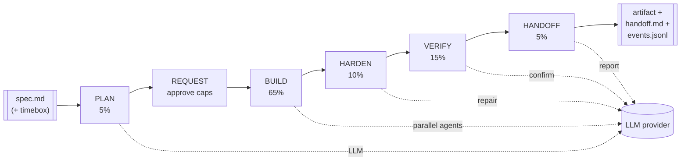
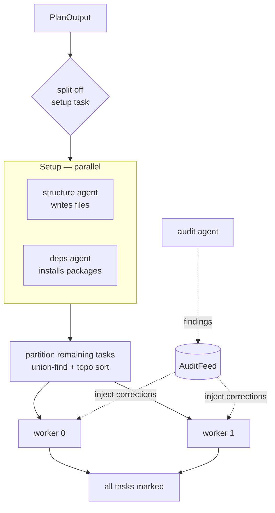
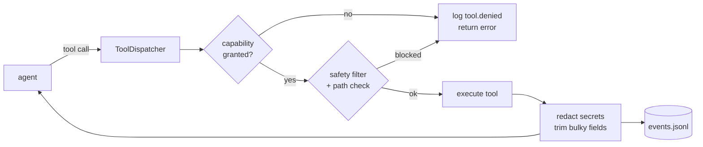
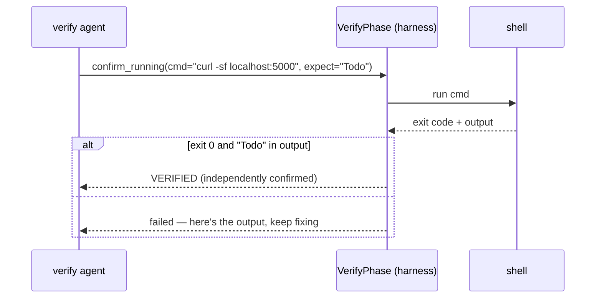

# Architecture

NoScope turns a written spec + a deadline into a runnable MVP, then always hands
back an artifact and a report. This document explains how it's built and — more
usefully — *why* the interesting pieces are built the way they are.

The design goal that drives everything: **a run must always terminate on time
and always produce output.** No hangs, no open-ended spend, no silent failure.
Every subsystem below is shaped by that constraint.

## System overview

A run is a fixed pipeline of phases. Each phase gets a slice of the timebox and
the whole thing is driven by one wall-clock `Deadline`.

| Phase | Uses LLM? | Responsibility |
|---|---|---|
| **PLAN** | yes (structured output) | Spec → a validated `PlanOutput` (tasks, capabilities, acceptance plan) |
| **REQUEST** | no | Human (or `--yes`) approves the capabilities the plan asked for |
| **BUILD** | yes (multi-agent) | A supervisor runs parallel build agents against the plan |
| **HARDEN** | only to repair | Run acceptance checks; auto-repair a failing one and re-run |
| **VERIFY** | yes (agent) | Get the app running and **independently confirm** it responds |
| **HANDOFF** | yes (cheap model) | Write the report — **always runs, even on error** |

`HANDOFF` runs in a `finally`-style path so a crash mid-BUILD still yields a
report. That's the "always produce output" guarantee in code, not just prose.

## The timebox engine

[`deadline.py`](noscope/deadline.py) is the spine. At construction it converts
the total timebox into cumulative per-phase wall-clock deadlines from a fixed
allocation (`PLAN 5% · BUILD 65% · HARDEN 10% · VERIFY 15% · HANDOFF 5%`).

Everything that could run long consults it:

- Agent loops check `deadline.is_expired()` / `should_transition(phase)` every
  iteration and stop cleanly.
- The shell tool derives each command's timeout from the time left in the phase.
- Phases that overrun eat into later phases rather than the wall clock slipping.

The deadline is *cooperative* — it doesn't kill threads, it gives every loop a
cheap check so they wind down and the pipeline advances to HANDOFF.

### The hole cooperative checking leaves

Checks happen *between* iterations, so nothing consults the deadline while a
request is in flight — and both SDKs default to a 600-second read timeout with
retries stacked on top. One stalled call could therefore outlast a five-minute
timebox entirely. That isn't a degraded guarantee; it's no guarantee.

So every provider call is wrapped by
[`DeadlineBoundProvider`](noscope/llm/bounded.py), which caps it at
`NOSCOPE_REQUEST_TIMEOUT` (120s) or the remaining timebox, whichever is
smaller. Two properties make it worth doing this way:

- The `wait_for` sits *outside* the SDK call, so the bound covers the SDK's
  internal retries too, not just one attempt.
- It's applied once, in the orchestrator, so every call site — plan, agents,
  harden, verify, handoff — is covered without any of them knowing about it.

There's one deliberate exception: a floor, because HANDOFF runs *after* the
deadline by design. The floor applies to the remaining timebox rather than to
the configured cap, so a deliberately small `NOSCOPE_REQUEST_TIMEOUT` is still
honored — it guards against an expired deadline, not against a choice.

## Multi-agent build

BUILD is the most concurrent part. The [`Supervisor`](noscope/supervisor.py)
runs setup first, then fans out.

Three design decisions worth calling out:

- **Setup is split into two cooperating agents** — one writes the project
  files, one installs dependencies — so scaffolding and `pip install` overlap
  instead of serializing.
- **Task partitioning uses union-find over the dependency graph**, then a
  topological sort within each work-stream ([`_partition_tasks`](noscope/supervisor.py)).
  This groups *transitively* dependent tasks onto the same worker so a worker
  never blocks on a file another worker hasn't written yet. Dependency cycles
  fall back to plan order instead of hanging.
- **The audit agent runs concurrently and feeds back through `AuditFeed`** — a
  small pub/sub channel with per-consumer cursors and dedup. Findings (bad
  JSON, missing entry point) are injected into the relevant worker's next turn
  as a correction, rather than accumulating in a log nobody reads.

Concurrency defaults to 2 workers — a deliberate, conservative choice to stay
under provider rate limits with several concurrent LLM streams — and is
configurable with `--workers`.

The audit agent isn't just an existence check: it compile-checks Python (and
parses JavaScript where `node` is available), so a file that cannot even parse
is surfaced to the worker that wrote it while there's still time to fix it.

### Write conflicts

Partitioning reduces overlap; it can't eliminate it, because the file
assignment ultimately comes from a model. So writes are also tracked at
runtime. A [`WriteLedger`](noscope/conflicts.py) records the last writer of
each path; when a *different* agent overwrites it with *different* content,
three things happen:

1. The clobbering agent gets a warning appended to its tool output — the only
   channel back into its conversation — telling it to re-read before editing.
2. A `write.conflict` event is logged.
3. The handoff report gets a "Parallel Write Conflicts" section, appended
   after generation so the model writing the report cannot omit it.

Writes are warned about, not blocked. Overlap is sometimes legitimate — a
worker adding a dependency to a manifest the setup agent created — and a
harness that refuses writes mid-build would fail more runs than it saves. The
failure being defended against is the silent one: two workers both "succeed",
last write wins, and the run reports a clean build over discarded work.

## Tools and capability gating

Agents don't touch the machine directly. Every action goes through a
capability-gated [`ToolDispatcher`](noscope/tools/dispatcher.py).

The tool surface is deliberately its own thing (not raw bash) so each action
can be gated, path-checked, logged, and redacted:

- **Filesystem:** `read_file` (with line windows), `write_file`,
  **`edit_file`** (exact-string replacement with a uniqueness guard + diff),
  `list_directory`, `create_directory`.
- **Discovery:** `search_files` (regex/grep) and `find_files` (glob), in-process
  and workspace-bounded.
- **Shell:** `exec_command` with a deny-list safety filter and a
  credential-scrubbed environment.
- **Git:** init/status/add/commit/diff.

Every path is validated against the workspace boundary; every command output is
run through secret redaction before it reaches the log or the model's context.
Capabilities (`WORKSPACE_RW`, `SHELL_EXEC`, `GIT`, …) are requested by the plan
and approved in REQUEST, so the human sees exactly what the run can do before it
does anything.

## Verification: execute, don't trust

This is the credibility core. The naive version — "ask the model whether the app
works" — lets a confident model declare success on a broken build. NoScope
verifies in two ways, both of which **run real commands**:

**HARDEN** runs the spec's acceptance checks. A check passes only if the command
exits `0` *and* (when the spec says `cmd: … ==> <text>`) the output actually
contains `<text>`. A failing check triggers a **bounded repair**: a small fix
agent gets the failing command and its output, edits the code, and the check is
**re-run** — the re-run is the authority, not the agent's say-so.

**VERIFY** gets the app running, then the agent must call a `confirm_running`
tool with a command that proves it (e.g. `curl -sf localhost:5000`). The
*harness* executes that command and accepts the verdict only if it genuinely
passes:

The verdict is grounded in an executed command every time. A model that asserts
success without a passing command simply doesn't get a "verified" run.

## Context management

Agent loops append every turn to a message list and can run for hundreds of
iterations, with whole-file reads and large command outputs landing in context.
Unbounded, that eventually fails on context length — and a failed request costs
that worker its remaining tasks. [`context.py`](noscope/context.py) applies two
cheap defenses before each request:

- **`truncate_tool_output`** caps any single tool result, keeping the head and
  tail (errors live at one end or the other) with a note of what was dropped.
- **`trim_history`** drops the oldest turns once the conversation exceeds a
  character budget, always keeping the system prompt and the original briefing,
  and leaving a note telling the agent to re-read files rather than trust
  memory of dropped output.

The subtle invariant: a tool result whose assistant turn was dropped is an *API
error*, not merely lost context. So the kept tail may never begin with a `tool`
message — enforced in code and swept across many conversation lengths in tests.

## Two budgets: time and tokens

NoScope's promise is a *spend cap*. It enforces that in both dimensions:

- **Wall-clock** — the `Deadline` above.
- **Tokens** — `TokenTracker` optionally carries a budget; the build, verify,
  and repair loops check `exceeded()` alongside the deadline and stop the same
  way. `--token-budget` makes the cap explicit.

Either limit ending the run still routes through HANDOFF, so you always get an
artifact and a report regardless of which cap you hit.

## The LLM layer

[`llm/`](noscope/llm/) is a thin provider abstraction (`complete()` over a
normalized message/tool/usage model) with Anthropic and OpenAI implementations.
It's intentionally small so keeping up with API changes is a one-file job — a
lesson from the fact that a single stale model default is what broke the project
before this rework.

It uses the current API surface and degrades gracefully:

- **Structured outputs** — the planner's Pydantic schema is enforced via
  `output_config.format` (Anthropic) / `response_format` (OpenAI), with a shared
  helper that makes a Pydantic schema acceptable to structured outputs.
- **Prompt caching** — `cache_control` breakpoints on the stable system prompt
  and tool list, so a long agent loop pays cache-read rates instead of full
  price on every turn. The cost summary reports what caching saved.
- **Adaptive thinking + effort**, with a *layered fallback*: if a (usually
  older, user-overridden) model rejects thinking/effort/structured-format, the
  provider degrades one capability at a time and remembers the result, so it
  pays the failed-request tax at most once per capability per run.
- **Per-role models** — the handoff report runs on a cheaper fast model at low
  effort; planning runs at high effort.
- **SDK-native retries** (honoring `Retry-After`) instead of a hand-rolled loop.

## Observability

Every tool call, LLM response, task completion, audit finding, and phase
transition is appended to `events.jsonl` (secret-redacted, bulky fields
trimmed). A run directory also holds `plan.json`, `contract.json`, the
capability grants, and `handoff.md`. The run is fully reconstructable after the
fact from the event log — which is also what makes the "observable" claim real
rather than aspirational.

## Key design decisions

| Decision | Why |
|---|---|
| **Own agent harness, not a wrapper over the Claude Agent SDK** | The orchestration *is* the project. Wrapping the SDK (Claude Code as a library) would make it "Claude Code with a timer" and give up provider-agnosticism. See [`PLAN.md`](PLAN.md) §3 for the full trade-off. |
| **Execute checks, don't trust the model** | Model-as-oracle verification is the worst failure mode for a demo. HARDEN and VERIFY both ground their verdicts in commands the harness runs. |
| **`edit_file` with a uniqueness guard, not whole-file rewrites** | Whole-file writes were the dominant token cost and caused last-write-wins clobbering; an edit that would match ambiguously *fails* rather than changing the wrong region. |
| **Cooperative deadline, not forced cancellation** | Cheap per-loop checks wind agents down cleanly so the pipeline always reaches HANDOFF, instead of killing work mid-write. The one thing cooperation can't cover — a request already in flight — is bounded at the provider boundary instead. |
| **Agents tolerate a few failed LLM calls, then stand down** | Tasks are partitioned into per-worker streams, so an exception escaping one agent used to silently cost that worker every remaining task. Three consecutive failures is enough to distinguish a blip from an outage without burning the timebox retrying. |
| **Capability gating + dedicated tools over raw bash** | Typed, gated tools can be path-checked, approved, logged, and redacted; an opaque bash string can't. |
| **Thin, single-file LLM layer** | Owning the harness means owning API churn; keeping the provider layer tiny makes a model/API change a one-line default, not a refactor. |

## Known limitations

Honest boundaries (tracked in [`PLAN.md`](PLAN.md) and [`RELEASE.md`](RELEASE.md)):

- The Docker sandbox uses a Python-only image and git tools still act on the
  host tree during `--sandbox` runs.
- Worker count defaults to 2 (raise with `--workers`), tuned conservatively
  for provider rate limits.
- The shell safety filter is a deny-list — a backstop, not a sandbox. Untrusted
  specs should use `--sandbox`.
- Live end-to-end behavior against a real model is validated by hand (see
  `RELEASE.md`), since CI has no API key. CI does run the full pipeline on
  every push via `--dry-run`, so the harness itself — CLI, capability gating,
  tool dispatch, phase budgets, acceptance checks, reporting — is covered; what
  isn't covered is model quality and the live provider wire format.
